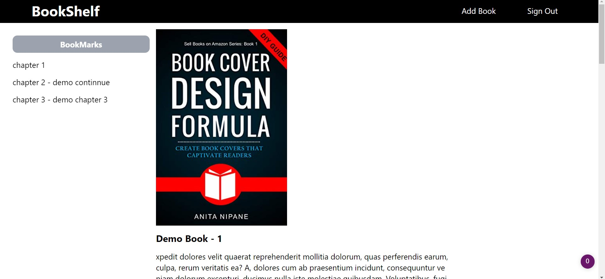
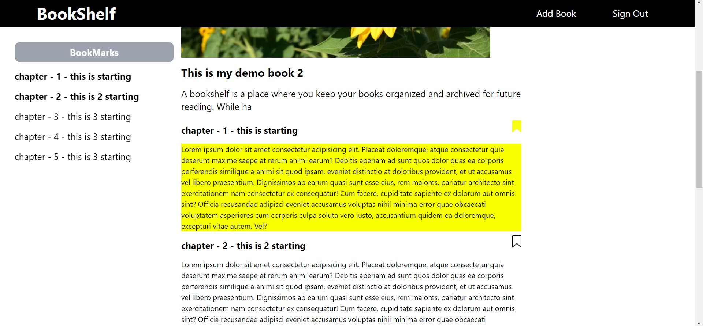

# [Front End URL](https://harshsinghs1058.github.io/bookshelf/) - hosted on github-pages

# [Demo URL](https://youtu.be/L-mcQ7n1gZ4) - Youtube

## Stacks Used

- React js
- Tailwind Css - (JIT mode)
- Firebase -Firestore
- Firebase - Email and Password based authentication
- Vite
- Context API

### Features

- Authentication
- Add New Book
- Bookmark Chapter of Book
- only bookmarked chapter show option
- side panel changes according to which chapter is currently visible on screen

## pages

- Sign up page
- Sign in page
- Books List page
- Book view Page
- Add New Book page

## How to start locally

- Install dependencies

```
npm i
```

- Run the project locally

```
npm run dev
```

- In any browser open
  - http://localhost:3000/bookshelf/

## ScreenShots

#### Sign in page


#### Sign up page


#### Home page


#### Book View Page



#### Book View(With bookmark) Page



#### Add New Book Page


